# API

```text
/
├── public/
├── src/
│   └── pages/
│       └── index.astro
│       └── [flight].astro
└── package.json
```

## De opdacht

Maak een server side rendered website die gebruikmaakt van 1 web API en 2 content API's.
Eisen:
- Een overview pagina
- Een een detail pagina

# Week 1
### Dag 1 • kickoff
#### Woensdag 01.04.26

<b>Wat heb ik vandaag gedaan?</b>
- Node.js op mijn laptop geïnstalleerd
- Astro template opgezet
- Eerste idee bedacht voor de overzicht en detail pagina met Stock Exchange API
https://api-ninjas.com/api/stockexchange

Design:


<b>Hoeveel tijd heeft me dat gekost?</b>
6 uur

<b>Wat heb ik geleerd?</b>
Meer over Astro, dat je JS in je HTML kunt gebruiken

<b>Wat ga ik morgen doen?</b>
Voortgang bespreken en horen of het idee goed genoeg is

##### Het idee 
Een stock app waar je bedrijven kan opzoeken...

### Voortgang week 1
<details>
<summary> Donderdag 02.04.26 </summary>

Wat we hebben besproken:
- Het is wel een leuk idee maar als je een 3D wereld gaat maken dan moet je er wel iets op kunnen visualiseren.
- Misschien andere data vinden waar je een visualisatie van kunt maken (de stockmarket API haalt maar 1 market op i.p.v meerdere).
- Als je 3D gaat doen met Threes.js (webGL) dan wordt dan erg veel werk (bedenk of je dat echt wil doen of toch iets anders kiest)
- Als je Three.js/WebGL gebruikt dan hoef je maar 1 web API te gebruiken in plaats van 2
- [github globe animation](https://www.youtube.com/watch?v=ddIZlWmfFKM)

Ideeën voor connecties
- https://rapidapi.com/RyanFin/api/mountain-api1
- https://www.mountain-forecast.com/peaks/Api

</details>

# Week 2

### Dag 2
#### Woensdag 08.04.26

<b>Wat heb ik vandaag gedaan?</b>
- Workshop over components in astro gedaan
- three.js in mijn astro project gezet
- Sphere in three.js gemaakt

Mijn eerste three.js sphere: 


Een simpele textured 3D globe in Three.js gemaakt:

```
	import * as THREE from 'three';
	import { OrbitControls } from 'three/examples/jsm/controls/OrbitControls.js';

	const w = window.innerWidth;
	const h = window.innerHeight;
	const scene = new THREE.Scene(); //container waar de HELE 3D scene in gaat
	const camera = new THREE.PerspectiveCamera(40, w / h, 0.1, 100); //wat de viewer ziet, een gedeelde van de 3D scene
	camera.position.z = 5; //camera pos

	const renderer = new THREE.WebGLRenderer({antialias: true}); //Maakt een nieuwe WebGL renderer

	renderer.setSize(w, h);
	document.body.appendChild(renderer.domElement);

	new OrbitControls(camera, renderer.domElement); //let camera orbit around object

	const loader = new THREE.TextureLoader();
	const geometry = new THREE.IcosahedronGeometry(1, 12);
	const material = new THREE.MeshStandardMaterial({map: loader.load("earthcloudmap.jpg")});
	const earthMesh = new THREE.Mesh(geometry, material);

	scene.add(earthMesh);

	const hemi = new THREE.HemisphereLight(0xffffff, 0x444444);
	scene.add(hemi);

	function animate()
	{
		requestAnimationFrame(animate);
		earthMesh.rotation.x += 0.001;
		earthMesh.rotation.y += 0.001;
		renderer.render(scene, camera);
	}

	animate();
```
Textured sphere:


<b>Hoeveel tijd heeft me dat gekost?</b>
De hele dag


<b>Wat heb ik geleerd?</b>
Meer over astro en three.js, het opzetten van beide is vrij simpel


### Dag 3
#### Donderdag 09.04.26

API voor de data die ik wil ophalen: https://openskynetwork.github.io/opensky-api/
<b>Wat heb ik vandaag gedaan?</b>
Ik heb vandaag geprobeerd GEO API data op een sphere te zetten maar dit lukte me niet. Ik heb andere data uit de opensky api kunnen halen.


<b>Hoeveel tijd heeft me dat gekost?</b>
Halve dag

### Voortgang week 2
<details>
<summary> Vrijdag 10.04.26 </summary>
Wat we hebben besproken:

- Laat 1 puntje op de wereld bol zien
- Visuals van de werled bol? Hoe gaan die eruit zien
- Eerst de vluchten van Nederland laten zien/filter in je URL eerst op vluchten die vanuit Nederland vertrekken
- Bedenk wat je echt wilt laten zien en echt in de site moet hebben
- Volgende donderdag -> knallen
</details>

# Week 3
### Dag 4
#### Donderdag 16.04.26
Half dagje api
wat heb ik gedaan? 
Inspo gevonden voor het ontwerp van de sphere.
- Ik wil een soort van wireframe 3d wereldbol een beetje dit ontwerp:
- Of ik ga meer de techy kant op met de stijl: 


Nu met een normale texture ziet het er saai uit


# Week 4
### Dag 5
#### Woensdag 22.04.26

Arcs of puntjes?
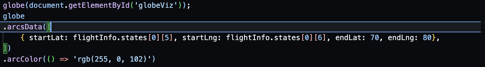
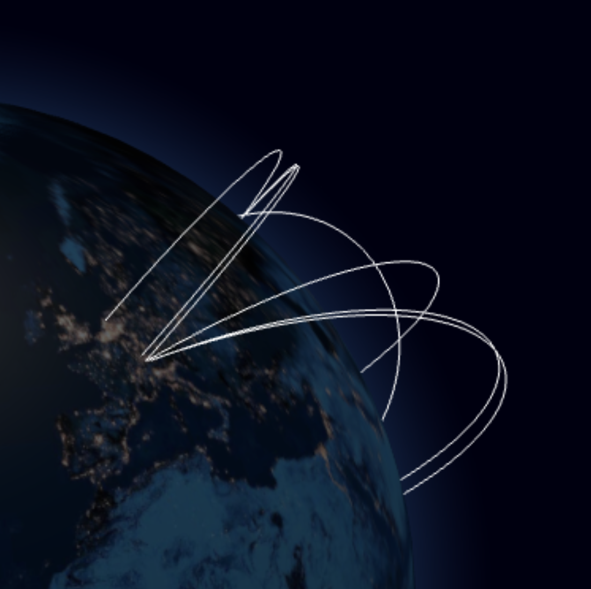
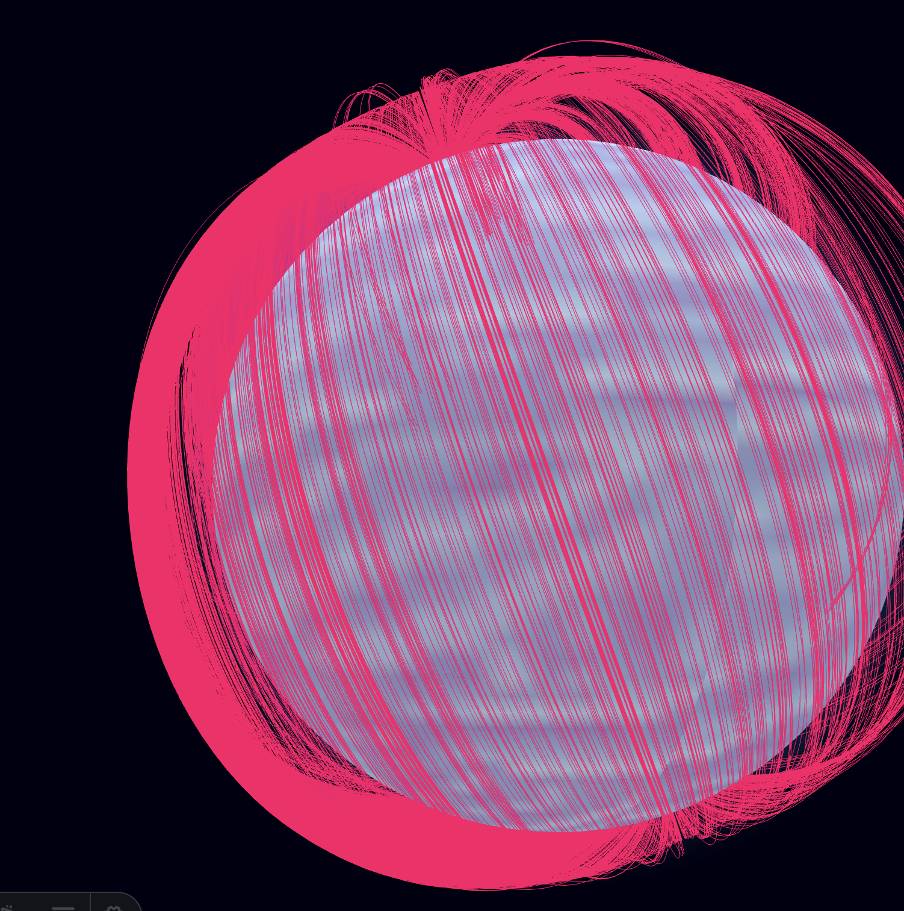
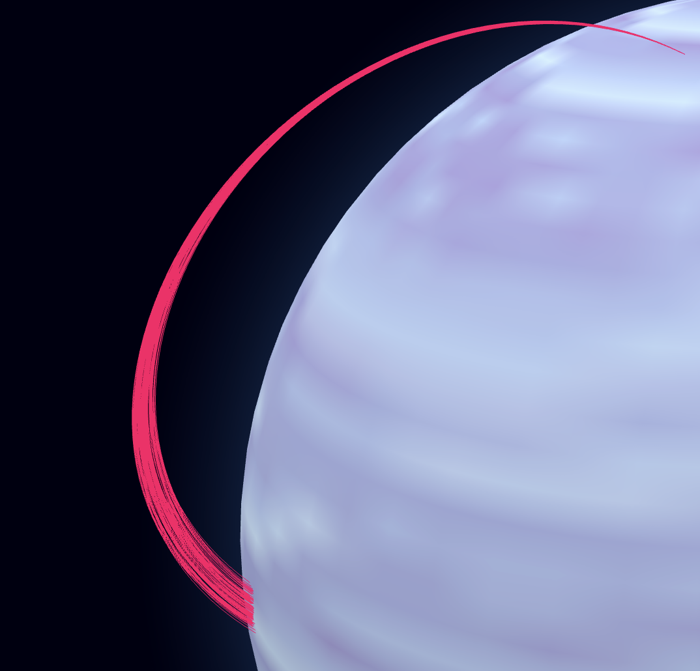
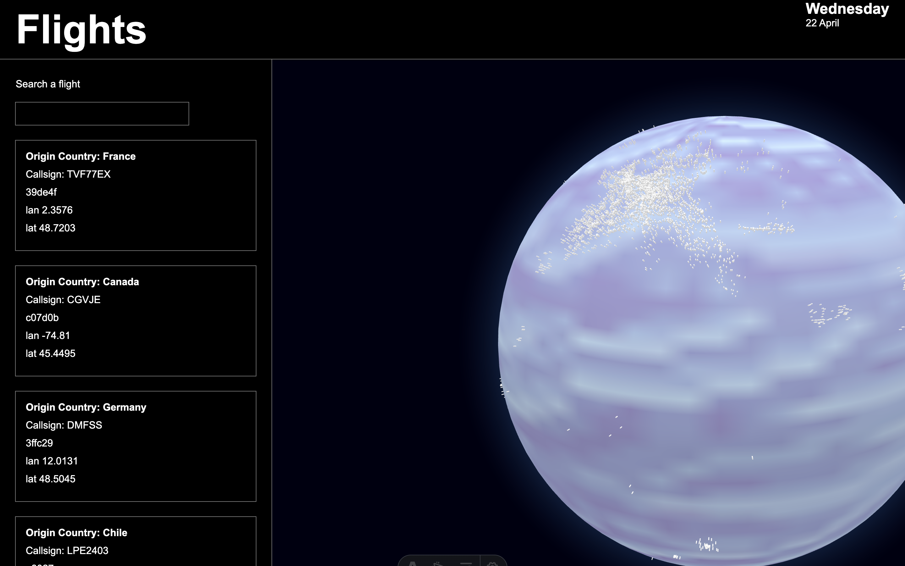
**wat heb ik gedaan?**
Geprobeerd de website live te zetten met Render en Netlify alleen lukte dit niet omdat de API een ```Timeout Error``` gaf op beide :( 
Blijkbaar blokeerd Opensky iets waardoor het live zetten steeds niet lukt.

```
	const CLIENT_ID = import.meta.env.CLIENT_ID;
	const CLIENT_SECRET = import.meta.env.CLIENT_SECRET;

	const response = await fetch(
	'https://auth.opensky-network.org/auth/realms/opensky-network/protocol/openid-connect/token',
	{
		method: 'POST',
		headers: {
		'Content-Type': 'application/x-www-form-urlencoded',
		},
		body: new URLSearchParams({
		grant_type: 'client_credentials',
		client_id: CLIENT_ID,
		client_secret: CLIENT_SECRET,
		}),
	}
	);

```

Nog meer problemen: Opensky gebruikt alleen de longitude and latitude van waar het vliegtuig NU staat en niet de start/eind punten van de vliegtuigen. 
Ik ga nu visualiseren waar de vliegtuigen staan i.p.v de arc maken.

Particles Layer?


### Dag 6
#### Donderdag 23.04.26
**wat heb ik gedaan vandaag?**
De data van de detail pagina 

de json data anders fetches (via een file) als de site op onrender staat met deze code
```
import staticData from "./../all.json" assert { type: "json" };

let flightInfo = undefined;
let onrender = import.meta.env.ONRENDER;

if (onrender)
{
	flightInfo = staticData;
}
else {
	const url = "https://opensky-network.org/api/states/all?lamin=45.8389&lomin=5.9962&lamax=47.8229&lomax=10.5226";
	const response = await fetch(url);
	flightInfo = await response.json();
	}
```

### Voortgang week 4
<details>
<summary> Vrijdag 24.04.26 </summary>
Wat we hebben besproken:

- Doe meer met de detail pagina -> hoogte van vliegtuigen laten zien
- Meer lievde voor de UI
- globe.gl gebruiken mag
- labels toevoegen aan de punten op de 3d globe?
- Filter opties toevoegen
- Op de detail pagina mag de 3d wereld terug komen

Todos voor de deadline (7 mei 6 uur)
- [x] finesse de stijl van de website 
- [x] zoek filters
- [x] detail pagina betere styling 

Geen tijd meer voor :'(
- [ ] visuals van de wereld
- [ ] misschien een extra animatie voor waar het vliegtuig staat op detail pagina
- [ ] theme switch voor de texture van de wereldbol

</details>

#### 06.05.26
Laatste dingen gedaan/styling op de site.
Ik bleef maar errors krijgen omdat bepaalde data niet initialized was als de globe nog aan het laden was:
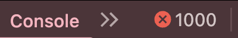
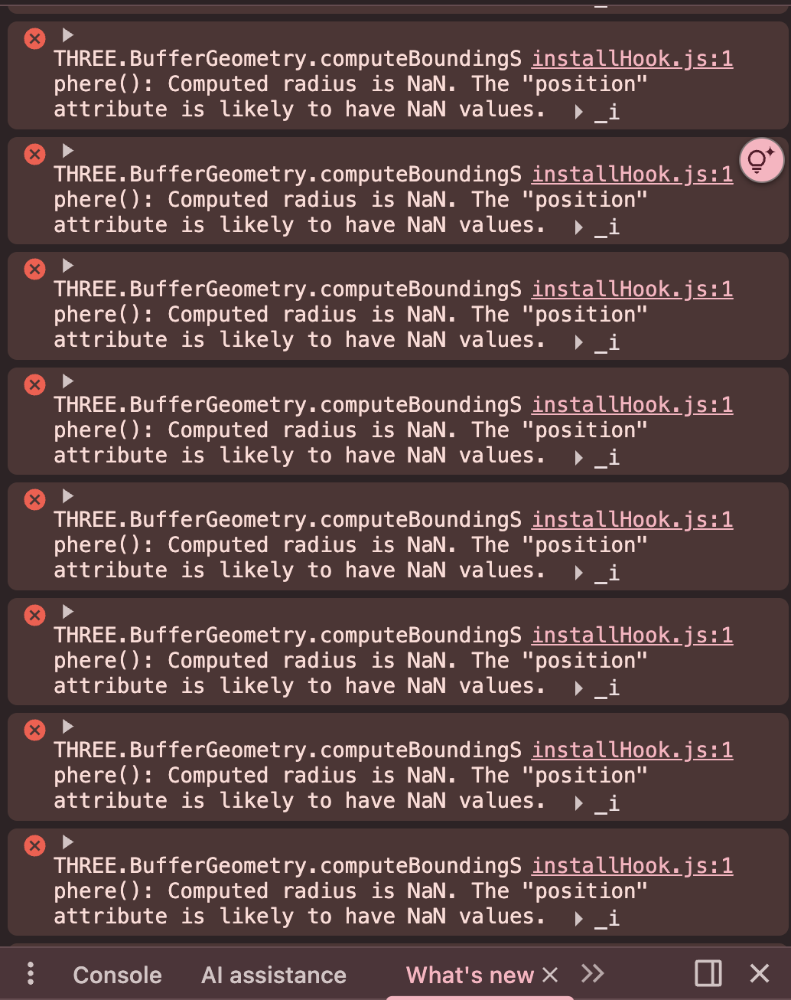
Toen vroeg ik aan claude wat de oplossing voor deze errors zou kunnen zijn: 
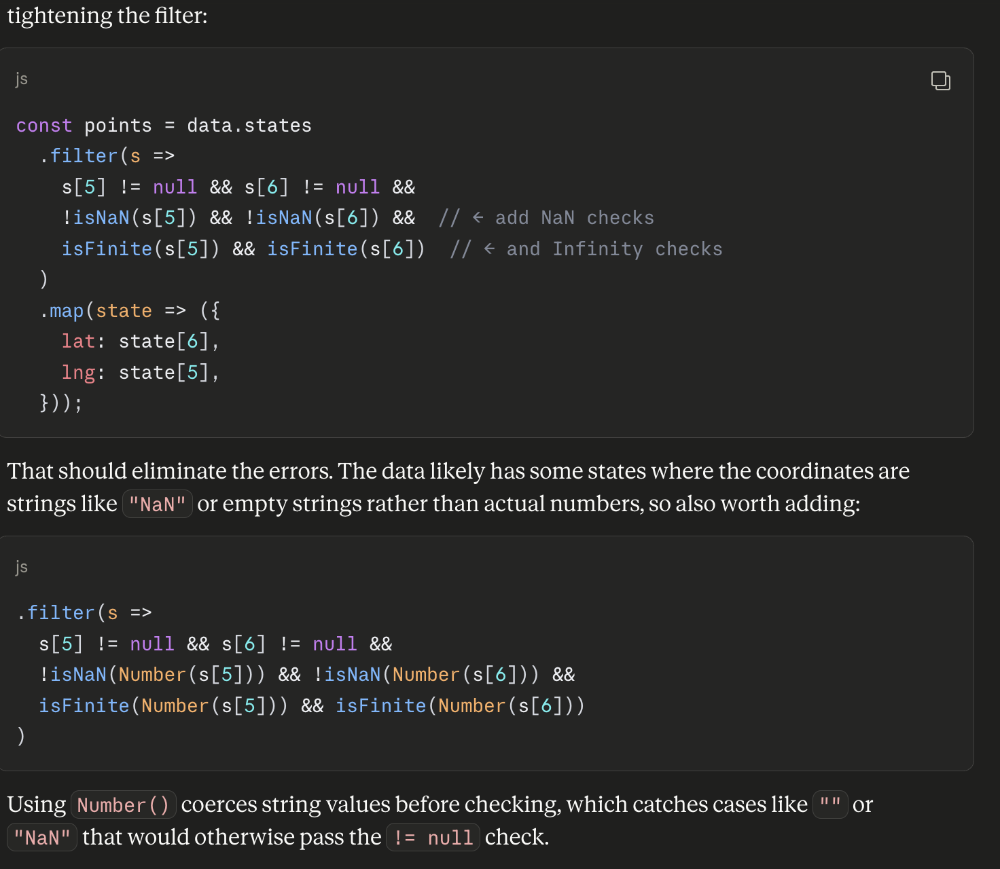
Maar dit deed eigenlijk helemaal niets en de errors waren er nog steeds.

Uiteindelijk had ik wel een suppression functie van claude gekregen die werkte: 

Error suppression gevonden via claude
AI code 
```
	// Suppress known globe.gl internal NaN warning
	const _error = console.error.bind(console);
		console.error = (...args) => {
		if (typeof args[0] === 'string' && args[0].includes('computeBoundingSphere')) return;
		_error(...args);
	};
```

### Eind reflectie
Ik kijk terug op dit vak als 1 van de leukere dingen uit de minor. We mochten echt experiementeren met een framework in plaats van vanilla html, css en js. Ik vond dit erg fijn omdat dit is hoe ik de meeste code van andere websites zie die gebouwd zijn in react/laravel.
Aan 1 kant vond ik dat erg fijn maar aan de andere kant erg irritant met files vinden als ik iets moest aanpassen. Ik vond het erg cool om te werken met een nieuwe technologie die ik nooit eerder heb gebruikt: THREE.js! Eigenlijk het werken met de library globe.gl (die THREE.js gebruikt)

#### Wat ging goed?
De overal website maken!

#### Wat kon beter/wat was moeilijk?
Eigenlijk alles met de astro site op onrender online krijgen. Eerst had ik problemen met de API omdat die werd geblokeerd door onrender en netlify. Er zit een limit op opensky en waardoor ik steeds een timeout error kreeg van opensky. Nadat ik een halve dag met Jad naar deze error had gekeken waren er volgens hem nog 2 opties:
- Een nieuwe API vinden (pro's de site zou makkelijker online gezet worden, con's kost misschien te veel tijd om een heel nieuwe API in de bestaande site te gooien aangezien ik al de data uit opensky heb gehaald).
- Een if statement maken voor als de site op onrender zit. Als de site op onrender zit dan fetched ie de data uit een .json bestand in plaats van de API online. (pro's de site kan live worden gezet! con's nu wordt de data gefetched uit een .json document en niet uit een API).

Ik heb de tweede optie gekozen omdat ik toch wel dezelfde data wou gebruiken zonder een hele refactor te doen op de website. Omdat ik dit probleem pas door had in de
laatste week waar ik ook echt nog aan de website kon werken vond ik dit een goede oplossing die ik nog wel kon redden met de deadline.

Toen ik de
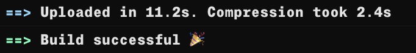
zag was ik erg blij.

Ik had ook problemen met de styling die half niet werd geladen op mijn website. Door de global.css in de public folder te zetten en een import te doen op de index.astro was dit wel gelukt gelukkig.

Ik ben niet helemaal blij met de styling van de 3d globe. Ik had niet een goede gratis texture van het internet kunnen plukken om de wereld er minder basic uit te laten zien.
De gratis textures die ik wel had gevonden waren lage kwaliteit en niet super mooi:
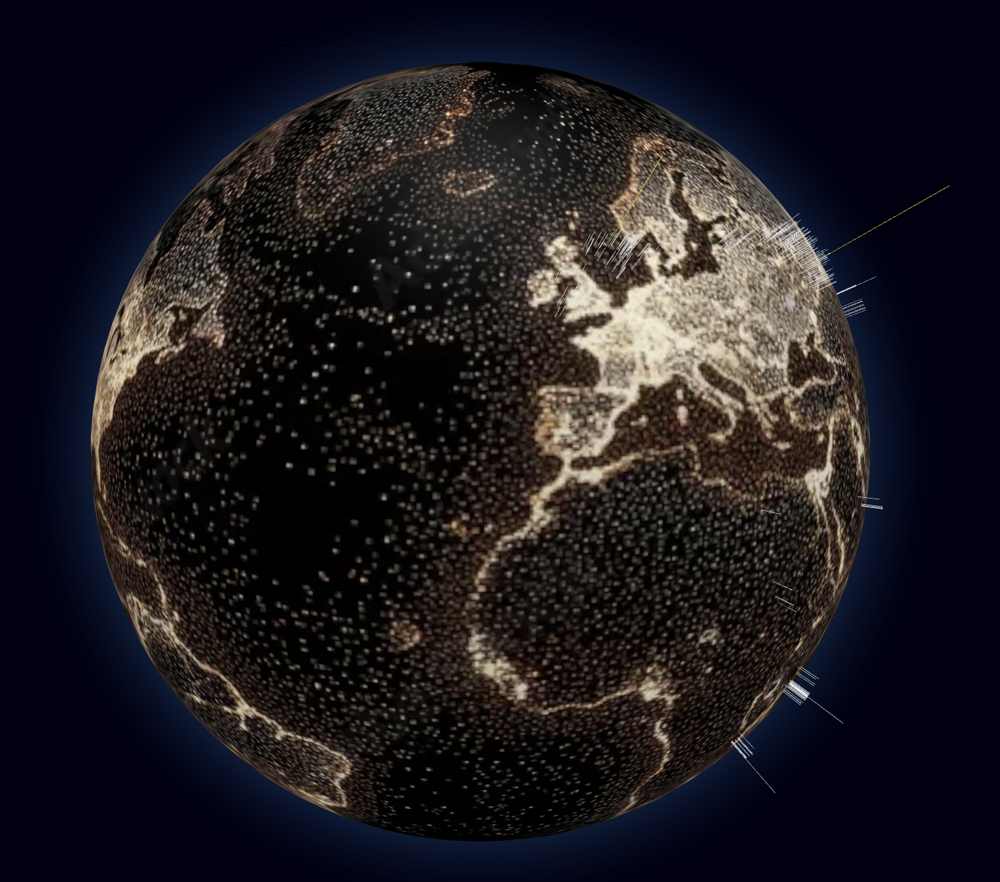
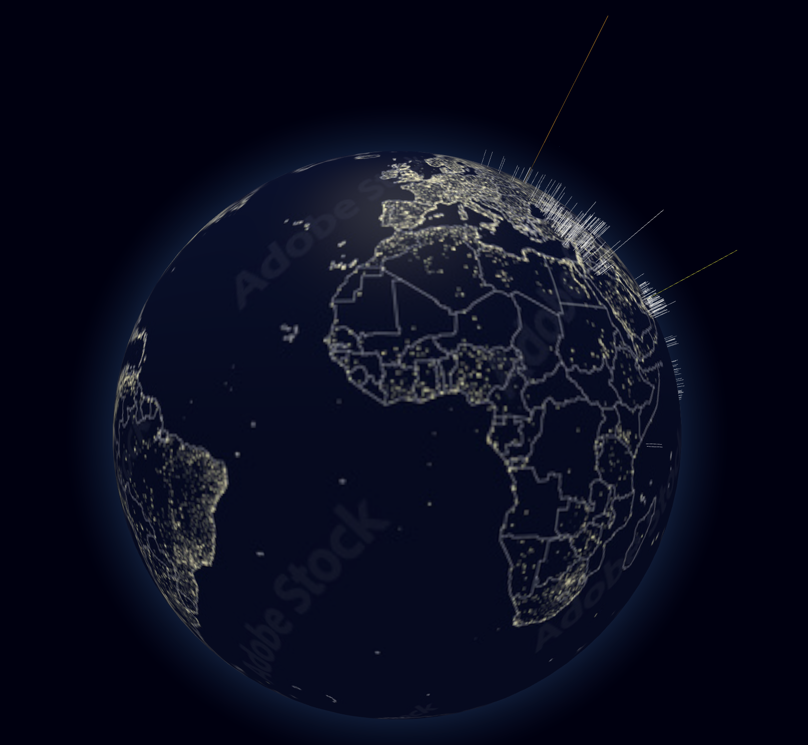
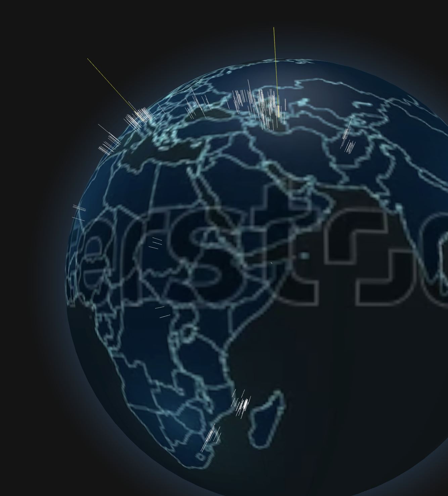
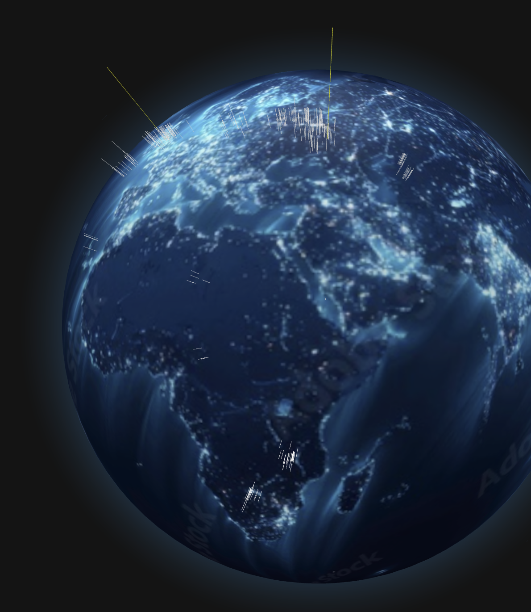


### Bronnen
[scrollbars](https://stackoverflow.com/questions/16670931/hide-scroll-bar-but-while-still-being-able-to-scroll)
[globe.gl, backgroundColor](https://globe.gl/)
[THREE.JS](https://threejs.org/manual/)
[Texture](https://stock.adobe.com/nl/images/world-map-illuminated-with-glowing-city-lights-and-coastlines-on-a-dark-black-background/1893362970)
- Claude en andere AI code heb ik gebruikt om errors uit de code te halen en een basis structuur op te zetten voor de code van de searchbar/filter functie