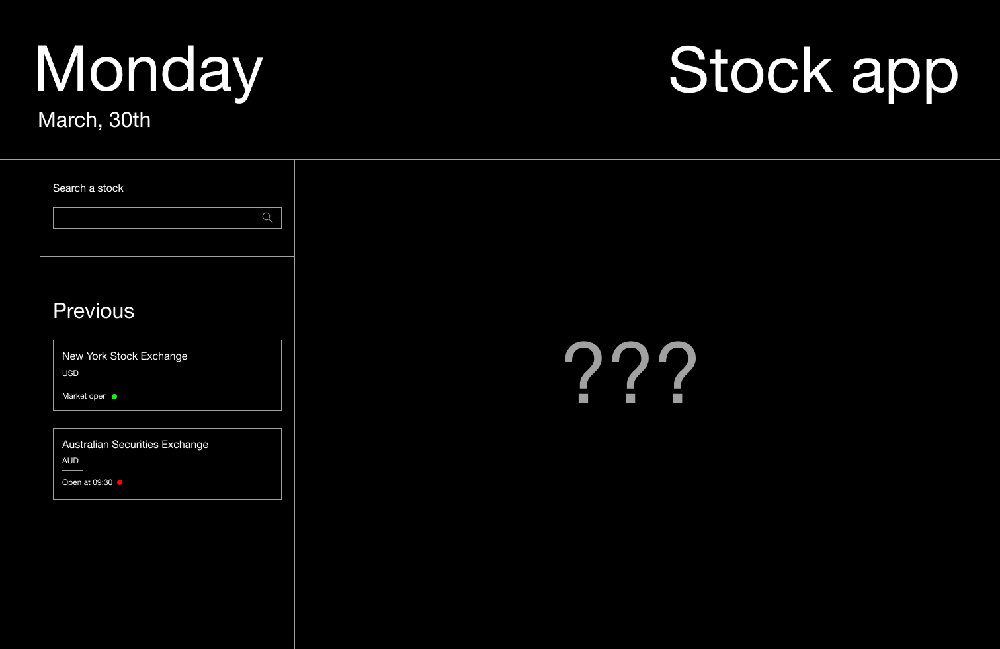
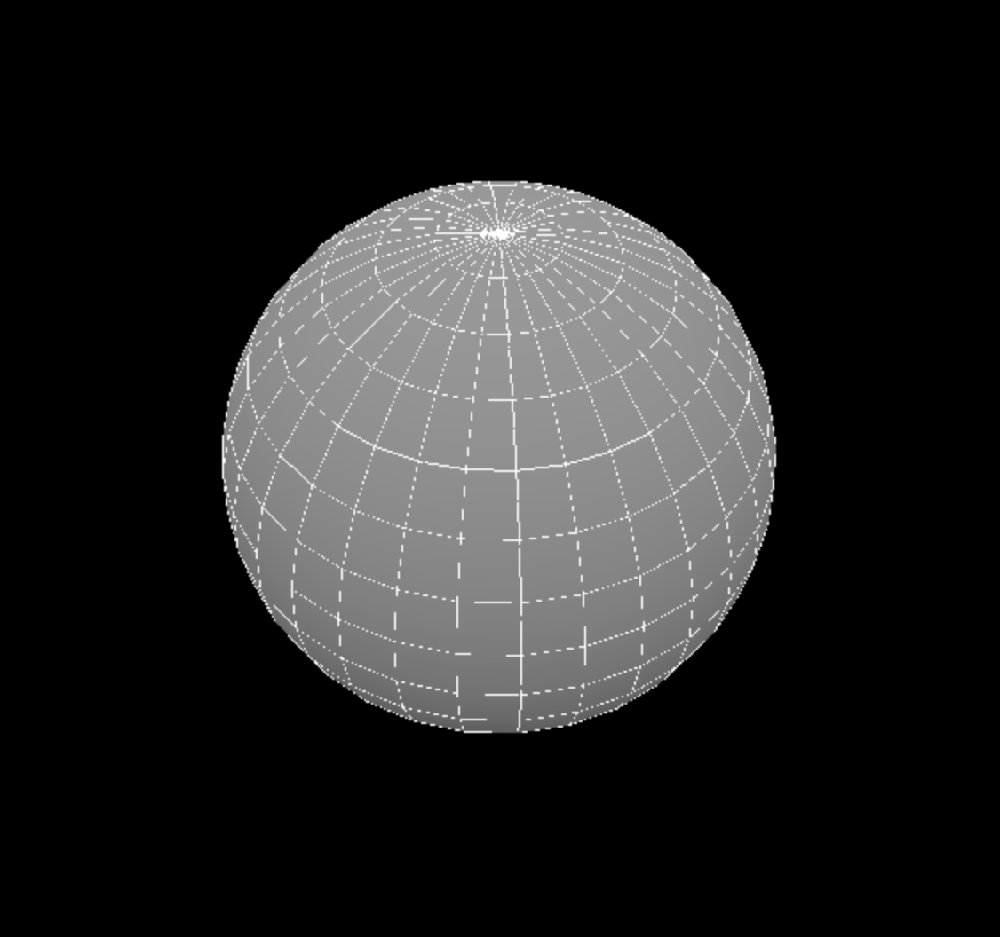
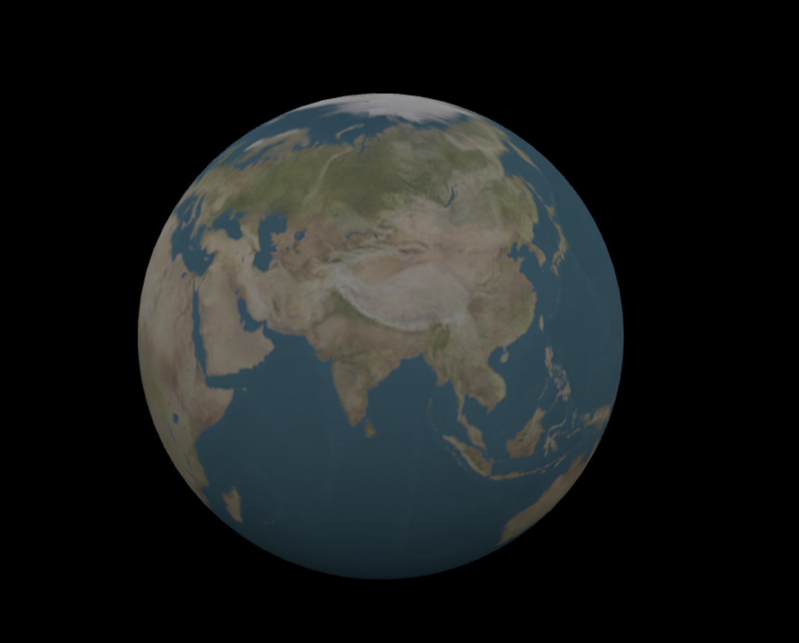
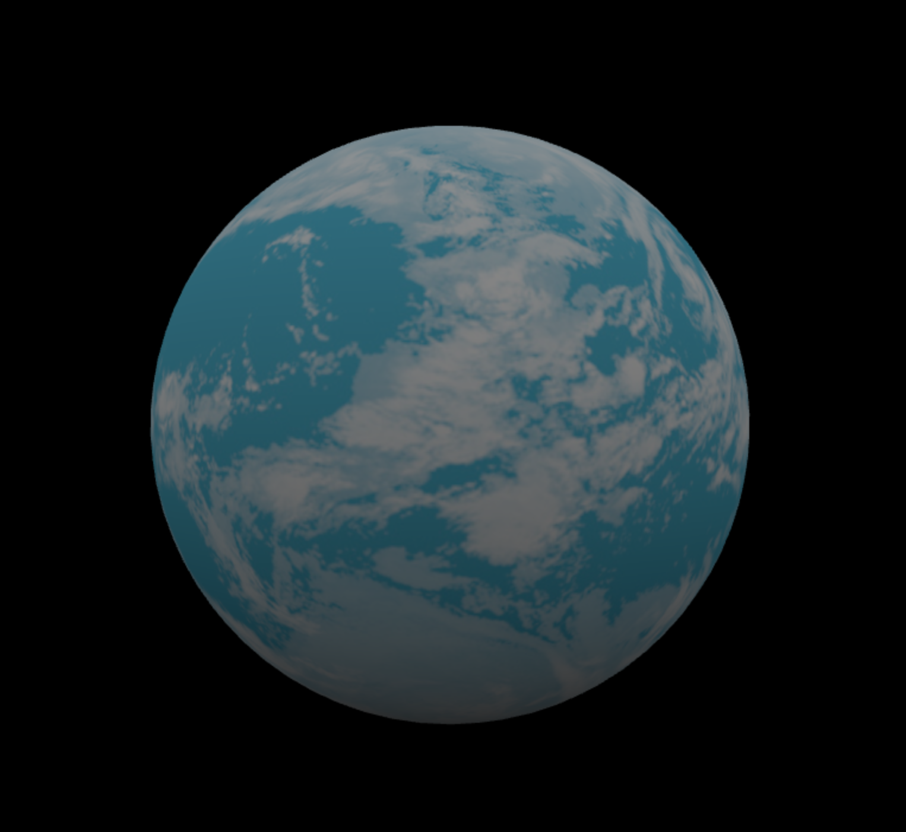
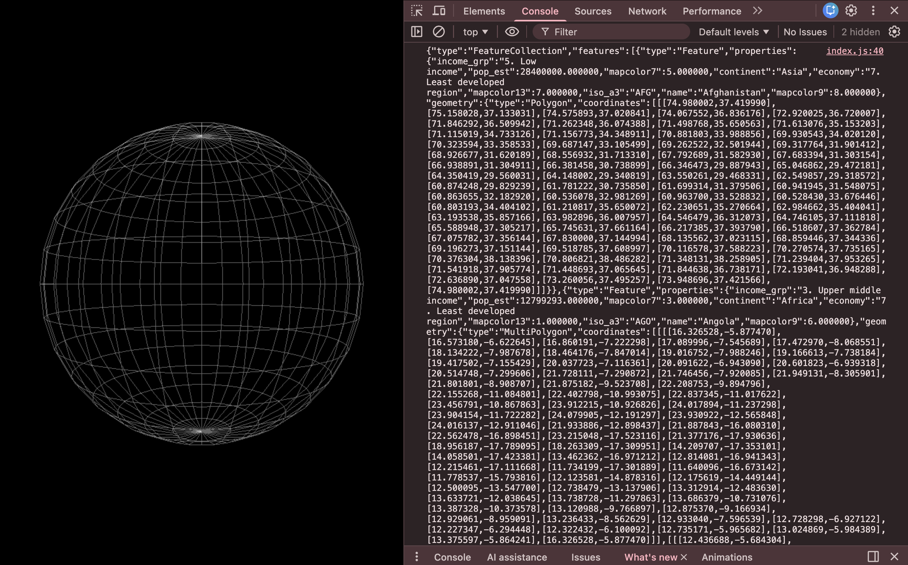
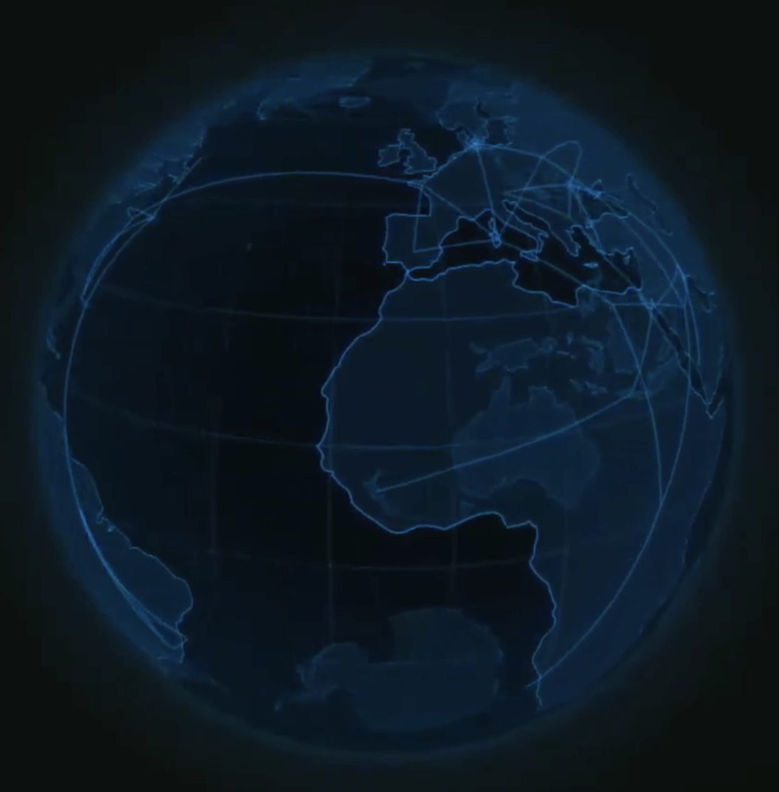
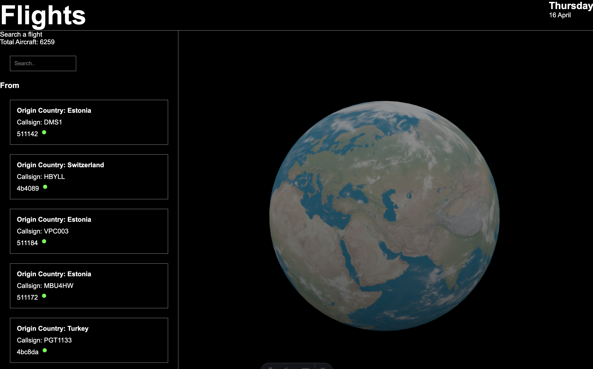

# API

```text
/
├── public/
├── src/
│   └── pages/
│       └── index.astro
└── package.json
```

## De opdacht

Maak een server side rendered website die gebruikmaakt van 1 web API en 2 content API's.
Eisen:
- Een overview pagina
- Een een detail pagina

# Week 1
### Dag 1 • kickoff
#### Woensdag 01.04.26

<b>Wat heb ik vandaag gedaan?</b>
- Node.js op mijn laptop geïnstalleerd
- Astro template opgezet
- Eerste idee bedacht voor de overzicht en detail pagina met Stock Exchange API
https://api-ninjas.com/api/stockexchange

Design:


<b>Hoeveel tijd heeft me dat gekost?</b>
6 uur

<b>Wat heb ik geleerd?</b>
Meer over Astro, dat je JS in je HTML kunt gebruiken

<b>Wat ga ik morgen doen?</b>
Voortgang bespreken en horen of het idee goed genoeg is

##### Het idee 
Een stock app waar je bedrijven kan opzoeken...

### Voortgang week 1
<details>
<summary> Donderdag 02.04.26 </summary>

Wat we hebben besproken:
- Het is wel een leuk idee maar als je een 3D wereld gaat maken dan moet je er wel iets op kunnen visualiseren.
- Misschien andere data vinden waar je een visualisatie van kunt maken (de stockmarket API haalt maar 1 market op i.p.v meerdere).
- Als je 3D gaat doen met Threes.js (webGL) dan wordt dan erg veel werk (bedenk of je dat echt wil doen of toch iets anders kiest)
- Als je Three.js/WebGL gebruikt dan hoef je maar 1 web API te gebruiken in plaats van 2
- [github globe animation](https://www.youtube.com/watch?v=ddIZlWmfFKM)

Ideeën voor connecties
- https://rapidapi.com/RyanFin/api/mountain-api1
- https://www.mountain-forecast.com/peaks/Api

</details>

# Week 2

### Dag 2
#### Woensdag 08.04.26

<b>Wat heb ik vandaag gedaan?</b>
- Workshop over components in astro gedaan
- three.js in mijn astro project gezet
- Sphere in three.js gemaakt

Mijn eerste three.js sphere: 


Een simpele textured 3D globe in Three.js gemaakt:

```
	import * as THREE from 'three';
	import { OrbitControls } from 'three/examples/jsm/controls/OrbitControls.js';

	const w = window.innerWidth;
	const h = window.innerHeight;
	const scene = new THREE.Scene(); //container waar de HELE 3D scene in gaat
	const camera = new THREE.PerspectiveCamera(40, w / h, 0.1, 100); //wat de viewer ziet, een gedeelde van de 3D scene
	camera.position.z = 5; //camera pos

	const renderer = new THREE.WebGLRenderer({antialias: true}); //Maakt een nieuwe WebGL renderer

	renderer.setSize(w, h);
	document.body.appendChild(renderer.domElement);

	new OrbitControls(camera, renderer.domElement); //let camera orbit around object

	const loader = new THREE.TextureLoader();
	const geometry = new THREE.IcosahedronGeometry(1, 12);
	const material = new THREE.MeshStandardMaterial({map: loader.load("earthcloudmap.jpg")});
	const earthMesh = new THREE.Mesh(geometry, material);

	scene.add(earthMesh);

	const hemi = new THREE.HemisphereLight(0xffffff, 0x444444);
	scene.add(hemi);

	function animate()
	{
		requestAnimationFrame(animate);
		earthMesh.rotation.x += 0.001;
		earthMesh.rotation.y += 0.001;
		renderer.render(scene, camera);
	}

	animate();
```
Textured sphere:



<b>Hoeveel tijd heeft me dat gekost?</b>
De hele dag


<b>Wat heb ik geleerd?</b>
Meer over astro en three.js, het opzetten van beide is vrij simpel


### Dag 3
#### Donderdag 09.04.26

API voor de data die ik wil ophalen: https://openskynetwork.github.io/opensky-api/
<b>Wat heb ik vandaag gedaan?</b>
Ik heb vandaag geprobeerd GEO API data op een sphere te zetten maar dit lukte me niet. Ik heb andere data uit de opensky api kunnen halen.


<b>Hoeveel tijd heeft me dat gekost?</b>
Halve dag

### Voortgang week 2
<details>
<summary> Vrijdag 10.04.26 </summary>
Wat we hebben besproken:

- Laat 1 puntje op de wereld bol zien
- Visuals van de werled bol? Hoe gaan die eruit zien
- Eerst de vluchten van Nederland laten zien/filter in je URL eerst op vluchten die vanuit Nederland vertrekken
- Bedenk wat je echt wilt laten zien en echt in de site moet hebben
- Volgende donderdag -> knallen
</details>

# Week 3
### Dag 4
#### Donderdag 16.04.26
Half dagje api
wat heb ik gedaan? 
Inspo gevonden voor het ontwerp van de sphere.
- Ik wil een soort van wireframe 3d wereldbol een beetje dit ontwerp:
- Of ik ga meer de techy kant op met de stijl: 


Nu met een normale texture ziet het er saai uit


# Week 4
### Dag 5
#### Woensdag 22.04.26
**wat heb ik gedaan?**
Geprobeerd de website live te zetten met Render en Netlify alleen lukte dit niet omdat de API een ```Timeout Error``` gaf op beide :( 
Blijkbaar blokeerd Opensky iets waardoor het live zetten steeds niet lukt.

```
	const CLIENT_ID = import.meta.env.CLIENT_ID;
	const CLIENT_SECRET = import.meta.env.CLIENT_SECRET;

	const response = await fetch(
	'https://auth.opensky-network.org/auth/realms/opensky-network/protocol/openid-connect/token',
	{
		method: 'POST',
		headers: {
		'Content-Type': 'application/x-www-form-urlencoded',
		},
		body: new URLSearchParams({
		grant_type: 'client_credentials',
		client_id: CLIENT_ID,
		client_secret: CLIENT_SECRET,
		}),
	}
	);

```

Nog meer problemen: Opensky gebruikt alleen de longitude and latitude van waar het vliegtuig NU staat en niet de 
start/eind punten. 
Ik ga nu visualiseren waar de vliegtuigen staan i.p.v de arc maken.

Particles Layer

### Dag 6
#### Donderdag 23.04.26

### Voortgang week 4
<details>
<summary> Vrijdag 24.04.26 </summary>
Wat we hebben besproken:
</details>